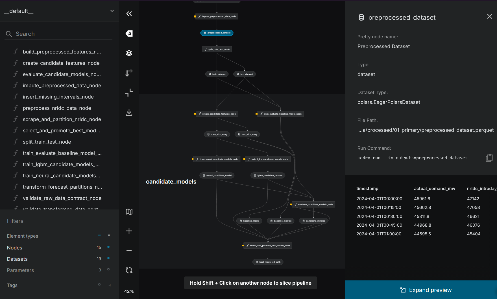
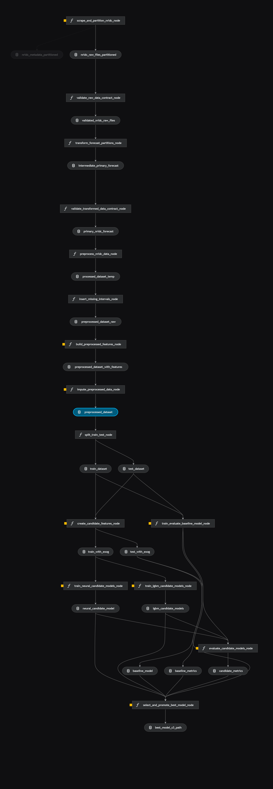

# Next Load: Energy Load Forecasting

Next Load is an automated, end-to-end data engineering and machine learning pipeline for forecasting energy load using data from the National Regional Load Dispatch Centre (NRLDC). The project emphasizes a robust, scalable, and observable "no local data" architecture.

## Pipelines Architecture

## How It Works

The system operates as a series of modular pipelines managed by **Kedro**, orchestrated for production via **Prefect 3**. 

1. **Extraction & Ingestion:** Raw energy forecast data is continuously scraped using **crawl4ai**. 
2. **Transformations:** All data manipulation is performed in-memory using **Polars** for high-speed processing. 
3. **Storage:** The project enforces a strict "No Local Data" mandate. All data, from raw ingestion to cleaned features and final model inputs, is persisted directly to a **GCP Garage S3** object store. Credentials are dynamically provisioned via **Infisical** machine identity.
4. **Model Training:** The pipeline trains both baseline models (e.g., Seasonal Naive) and candidate models (e.g., LightGBM). Model artifacts and predictions are similarly synced to S3.
5. **Experimentation & Versioning:** Every training run is tracked via **MLflow** (`kedro-mlflow`). Model packaging and the development cycle are managed using **Jozu Kitops** via a `Kitfile`.
6. **Data Drift & Observation:** **NannyML** is integrated to perform pre- and post-deployment data distribution and drift analysis, outputting reports for monitoring.
7. **Orchestration:** **Prefect** serves the deployments on a set schedule:
   - *Daily:* Extraction, loading, and data processing.
   - *Weekly:* A holistic run encompassing the ETL steps, plus baseline training, candidate model training, and data distribution analysis.

## Development & Execution

- **Environment Management:** Dependencies are managed using `uv` (requires Python 3.13+).
- **Execution:** Kedro pipelines can be executed individually (e.g., `uv run kedro run --pipeline extract_load_transform`).
- **Orchestration Server:** Prefect flows are deployed and served via `uv run python src/orchestrator/next_load_orchestrator.py`.
- **Exploration:** Interactive pipeline exploration is supported via **Marimo** notebooks.
